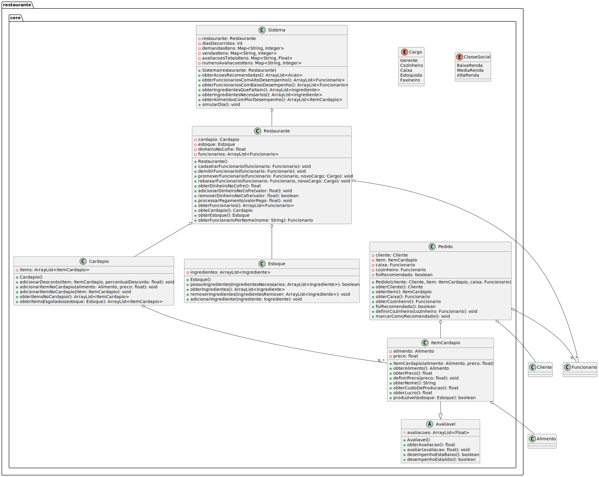
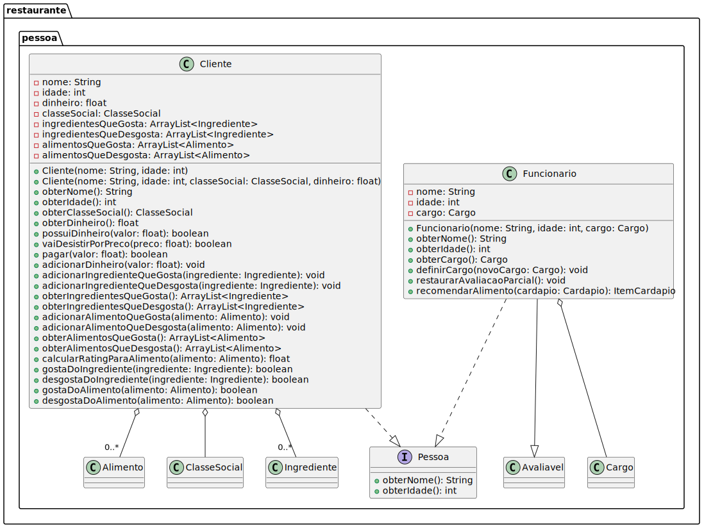
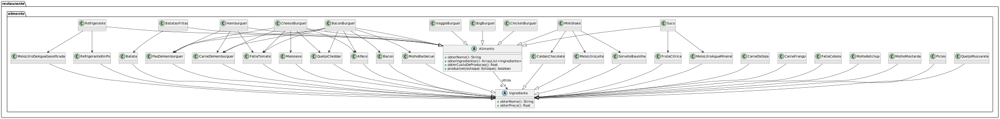
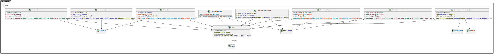

# Restaurante (Projeto de POO)

## Sobre o Projeto

Este projeto é uma simulação de um sistema de gestão para um restaurante, desenvolvido como um trabalho da disciplina de **Programação Orientada a Objetos (POO)**. O sistema modela operações diárias como gerenciamento de estoque, cardápio, funcionários, e processamento de pedidos. Ele também inclui uma lógica de "sistema de negócio" para analisar o desempenho e fornecer recomendações estratégicas.

[Licença MIT](./LICENSE.md)

## Perguntas Respondiades com Métodos
1. Quais os funcionários com melhor desempenho?
2. Quais são os alimentos com maior demanda?
3. Quais são os ingredientes que faltam para colocar no estoque?
4. Que funcionários devemos provomer?
5. Qual o preço máximo que develos cobrar pelos alimentos?
6. Quais as ações administrativas que o gerende deve tomar?

As perguntas equivalem a métodos implementados na classe Sistema (Checar UML).

## Como Executar

### Pré-requisitos

- **Java 21** ou superior
- **GNUMake** (Para Windows ou Linux)
- Sistema operacional Windows ou Linux

### Instalação de Dependências

#### Instalação do Java 21

**Windows**

- **Com `winget` (recomendado):** Abra o **PowerShell como Administrador** e execute:
```powershell
winget install Oracle.OpenJDK.21
```

- **Instalação manual (sem `winget`):** Baixe o instalador `.msi` para Windows na página de downloads oficial do OpenJDK 21 da Oracle e siga as instruções de instalação.

**Linux**

- **Em sistemas baseados em Debian/Ubuntu:**
```bash
sudo apt update
sudo apt install openjdk-21-jdk
```
- **Em sistemas baseados em Fedora/Red Hat:**
```bash
sudo dnf install java-21-openjdk-devel
```

#### Instalação do GNUMake

**Windows**

- **Com `winget`:** Abra o **PowerShell como Administrador** e execute:

```powershell
winget install GnuWin32.Make
```

- **Instalação manual:** A forma mais comum de obter o `make` no Windows é instalando o [MSYS2](https://www.msys2.org/). Após a instalação, use seu gerenciador de pacotes, o `pacman`, para instalar o `make`:

```bash
pacman -S make
```

**Linux**

- Na maioria das distribuições Linux, o GNUMake já vem pré-instalado. Para verificar, execute `make --version` no terminal.
- Se não estiver instalado, utilize seu gerenciador de pacotes:
  - **Em sistemas baseados em Debian/Ubuntu:**
  ```bash
  sudo apt update
  sudo apt install make
  ```
  - **Em sistemas baseados em Fedora/Red Hat:**
  ```bash
  sudo dnf install make
  ```

### Compilação e Execução

1.  **Clone o repositório**

```bash
git clone https://github.com/mguinhos/Restaurante
cd Restaurante
```

2.  **Compile o projeto**

```bash
make build
```

3.  **Execute o programa**

```bash
make run
```


## Diagramas de Classes UML

Os diagramas de classes abaixo ilustram a arquitetura completa do projeto e as relações entre suas classes.

### 1. Classes Principais do Restaurante

Este é o diagrama principal que mostra o núcleo do sistema: as classes **`Restaurante`**, **`Cardapio`**, **`Estoque`**, **`Pedido`** e **`Sistema`**. Ele também apresenta a interface **`Avaliavel`**, que é a base para a avaliação de desempenho de funcionários e itens.



**Análise do Diagrama:**

- **`Restaurante`** é o agregador central, com associações de composição (losango preenchido) para `Cardapio`, `Estoque` e `Funcionario`, indicando que esses objetos fazem parte integral do restaurante.
- **`Sistema`** usa (`--`) a classe `Restaurante` para coletar dados e realizar análises.
- **`ItemCardapio`** implementa (`--|>`) a interface `Avaliavel`, o que permite que ele seja avaliado por clientes.
- As classes `Cargo` e `ClasseSocial` são enums, que definem um conjunto fixo de valores e são usadas por outras classes para tipagem.


### 2. Classes de Pessoas e Funcionários

Este diagrama detalha a hierarquia das classes de pessoas no sistema.



**Análise do Diagrama:**

- A interface **`Pessoa`** define um contrato básico para qualquer pessoa no sistema, como obter nome e idade.
- As classes **`Cliente`** e **`Funcionario`** implementam (`..|>`) a interface `Pessoa`, garantindo que ambas tenham os métodos básicos definidos.
- A classe `Funcionario` também implementa a interface `Avaliavel`, permitindo que seu desempenho seja avaliado. Há uma associação entre `Funcionario` e o enum `Cargo`.


### 3. Classes de Alimentos e Ingredientes

Aqui estão as classes que definem o que é vendido e o que é usado para produção.



**Análise do Diagrama:**

- As classes **`Alimento`** e **`Ingrediente`** são abstratas, o que significa que não podem ser instanciadas diretamente. Elas servem como base para as subclasses concretas.
- Todas as subclasses de `Alimento` e `Ingrediente` herdam (`--|>`) seus respectivos comportamentos, como o cálculo de custo de produção e o nome do item.
- Uma associação entre `Alimento` e `Ingrediente` indica que um alimento é composto por um ou mais ingredientes.


### 4. Classes de Ações

Este diagrama mostra o sistema de ações gerenciais, que permite ao `Sistema` recomendar e ao usuário executar ações estratégicas.



**Análise do Diagrama:**

- A classe **`Acao`** é uma classe abstrata que define um contrato comum para todas as ações do sistema, como `executar()` e `obterNome()`.
- Todas as classes de ações específicas (`AplicarDesconto`, `DemitirFuncionario`, etc.) herdam (`--|>`) de `Acao`, garantindo que elas possam ser tratadas de forma polimórfica pelo sistema.
- A maioria das ações tem associações com outras classes do projeto (`Restaurante`, `Cardapio`, `Funcionario`, etc.), pois precisam manipular o estado desses objetos para serem executadas.


## Estrutura do Projeto

```
restaurante/
├── Main.java                          # Classe principal com interface do usuário
├── Restaurante.java                   # Classe principal do restaurante
├── Sistema.java                       # Sistema de simulação e recomendações
├── Cardapio.java                      # Gestão do cardápio
├── ItemCardapio.java                  # Item individual do cardápio
├── Estoque.java                       # Controle de estoque
├── Pedido.java                        # Representação de pedidos
├── Avaliavel.java                     # Classe abstrata para avaliações
├── Cargo.java                         # Enum dos cargos
├── ClasseSocial.java                  # Enum das classes sociais
├── pessoa/
│   ├── Pessoa.java                    # Interface para pessoas
│   ├── Cliente.java                   # Classe cliente
│   └── Funcionario.java               # Classe funcionário
├── alimento/
│   ├── Alimento.java                  # Classe abstrata de alimentos
│   ├── Hamburguer.java                # Hambúrguer básico
│   ├── CheeseBurguer.java             # Hambúrguer com queijo
│   ├── BaconBurguer.java              # Hambúrguer com bacon
│   ├── BigBurguer.java                # Hambúrguer duplo
│   ├── ChickenBurguer.java            # Hambúrguer de frango
│   ├── VeggieBurguer.java             # Hambúrguer vegetariano
│   ├── BatatasFritas.java             # Batatas fritas
│   ├── Refrigerante.java              # Refrigerante
│   ├── MilkShake.java                 # Milk shake
│   └── Suco.java                      # Suco natural
├── ingrediente/
│   ├── Ingrediente.java               # Classe abstrata de ingredientes
│   └── [25 tipos de ingredientes...]
├── acao/
│   ├── Acao.java                      # Classe abstrata de ações
│   ├── AplicarDesconto.java           # Aplicar desconto em item
│   ├── AumentarPreco.java             # Aumentar preço de item
│   ├── BaixarPreco.java               # Baixar preço de item
│   ├── DeclararFalencia.java          # Declarar falência
│   ├── DemitirFuncionario.java        # Demitir funcionário
│   ├── PromoverFuncionario.java       # Promover funcionário
│   ├── RebaixarFuncionario.java       # Rebaixar funcionário
│   └── ReporIngredienteNoEstoque.java # Repor ingredientes
└── erros/
└── FuncionarioNaoEncontradoErro.java  # Exception customizada
```

### Interface do Usuário

O sistema utiliza interface de linha de comando com navegação por teclas:

- **W/↑**: Navegar para cima
- **S/↓**: Navegar para baixo
- **Enter**: Selecionar opção
- **Q**: Sair/Voltar

## Fluxo de Execução

1.  **Inicialização**: Sistema cria restaurante com funcionários e cardápio inicial
2.  **Simulação 30 Dias**: Execução automática de 30 dias de operação
3.  **Dashboard do Franqueado**: Interface interativa para gestão pós-simulação

### Simulação Diária Inclui:

- Geração aleatória de clientes com diferentes perfis
- Processamento de pedidos e pagamentos
- Avaliação de funcionários baseada em desempenho
- Atualização de estoque e reposição automática
- Cálculo de receitas, custos e lucros
- Pagamento semanal de salários
- Sistema de recomendações gerenciais

## Arquitetura e Padrões

### Padrões de Design Utilizados

- **Strategy Pattern**: Diferentes tipos de alimentos e ingredientes
- **Command Pattern**: Sistema de ações gerenciais
- **Observer Pattern**: Sistema de avaliações
- **Factory Pattern**: Criação de clientes e funcionários

### Conceitos de POO Aplicados

- **Encapsulamento**: Atributos privados com métodos de acesso
- **Herança**: Hierarquia de classes para Alimento, Ingrediente, etc.
- **Polimorfismo**: Implementações específicas de métodos abstratos
- **Abstração**: Classes abstratas e interfaces para contratos

### Tratamento de Exceções

- Exception customizada para funcionários não encontrados
- Validações de negócio em operações financeiras
- Controle de fluxo para situações de estoque esgotado

## Funcionalidades Avançadas

### Sistema de IA Simulado

- **Análise de Padrões**: Identificação de tendências de demanda
- **Recomendações Inteligentes**: Sugestões baseadas em dados históricos
- **Otimização Automática**: Ajustes de preços baseados em performance

### Métricas e Analytics

- **Taxa de Conversão**: Percentual de clientes que fazem pedidos
- **Rentabilidade**: Cálculo de lucro por período
- **Performance de Funcionários**: Ranking baseado em avaliações
- **Análise de Cardápio**: Items mais e menos populares

### Gestão Financeira Avançada

- **Controle de Fluxo de Caixa**: Receitas vs. Despesas
- **Projeções**: Estimativas baseadas em histórico
- **Alertas**: Notificações de situações críticas
- **Relatórios**: Summários detalhados de performance

## Cenários de Teste

O sistema inclui diversos cenários para testar:

- **Crescimento Sustentável**: Bom gerenciamento leva ao sucesso
- **Crise Financeira**: Má gestão pode levar à falência
- **Rotatividade de Funcionários**: Impacto de contratações/demissões
- **Flutuações de Demanda**: Adaptação a mudanças no mercado

## Extensibilidade

O sistema foi projetado para fácil extensão:

- **Novos Alimentos**: Basta estender a classe `Alimento`
- **Novos Ingredientes**: Implementar a classe abstrata `Ingrediente`
- **Novas Ações**: Estender a classe `Acao` para funcionalidades gerenciais
- **Novos Cargos**: Adicionar ao enum `Cargo` e implementar lógica
- **Novos Relatórios**: Expandir o sistema de dashboard

## Documentação Técnica

### Dependências

- Java Standard Library (Collections, Scanner, Random)
- Nenhuma dependência externa necessária

## Licença

Este projeto foi desenvolvido para fins educacionais como parte da disciplina de Programação Orientada a Objetos.

---

2025 - Inaldo Neto, Lucas Soares e Marcel Guinhos - UNICAP