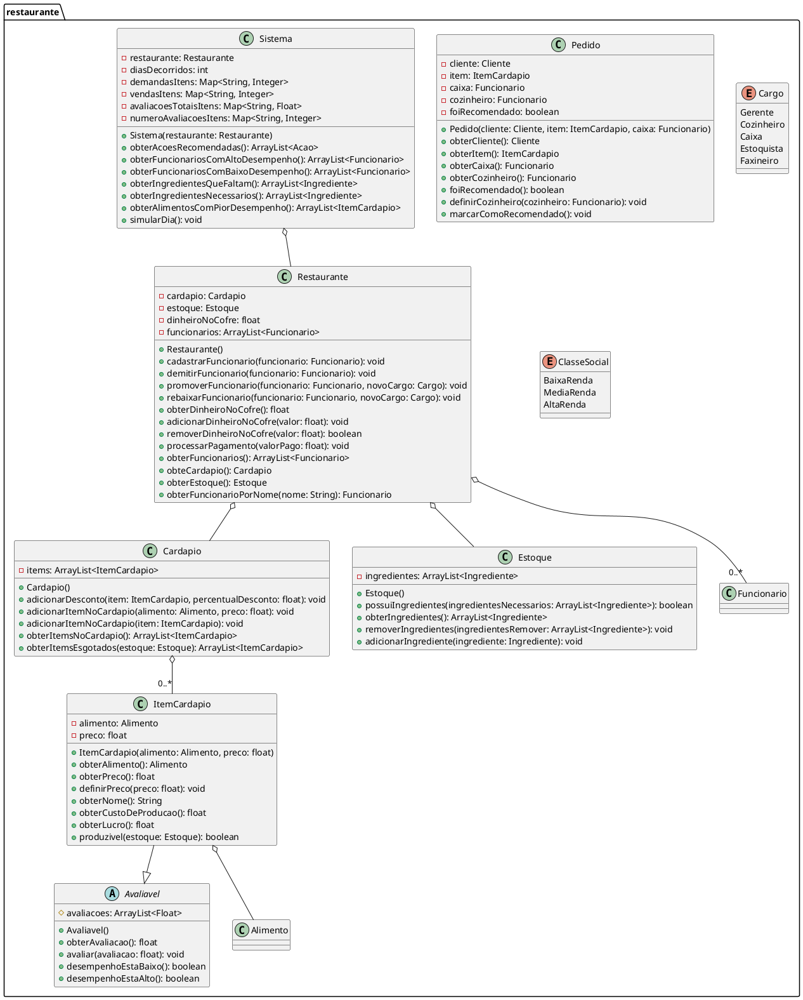
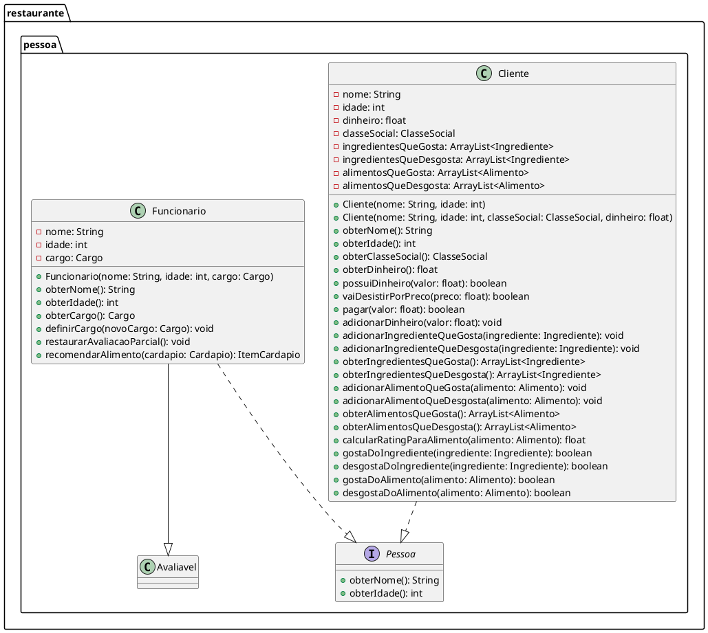
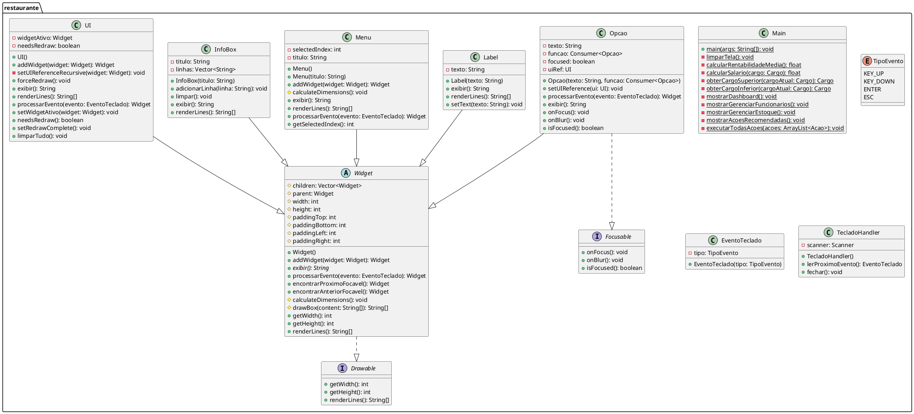
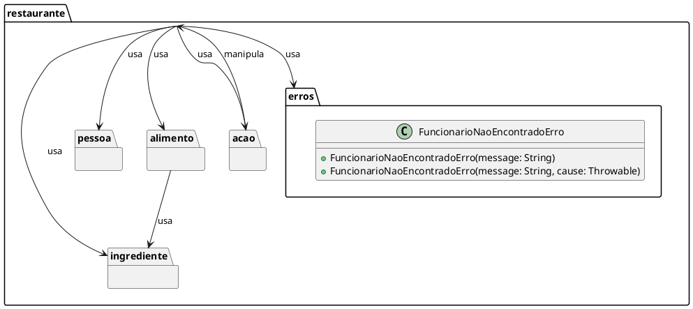

# Código Fonte do UML PlanetUML

Cada UML (Diagrama de Classes) renderizados está na pasta renderizado pela ordem

## Classes Principais do Restaurante

## Classes de Pessoa e Funcionários

## Classes de Alimentos

```plantuml
@startuml

package restaurante.alimento {
  abstract class Alimento {
    + {abstract} obterNome(): String
    + {abstract} obterIngredientes(): ArrayList<Ingrediente>
    + obterCustoDeProducao(): float
    + produzivel(estoque: Estoque): boolean
  }

  class Hamburguer {
    + obterNome(): String
    + obterIngredientes(): ArrayList<Ingrediente>
  }

  class BatatasFritas {
    + obterNome(): String
    + obterIngredientes(): ArrayList<Ingrediente>
  }

  class Refrigerante {
    + obterNome(): String
    + obterIngredientes(): ArrayList<Ingrediente>
  }

  class CheeseBurguer {
    + obterNome(): String
    + obterIngredientes(): ArrayList<Ingrediente>
  }
  
  class BaconBurguer {
    + obterNome(): String
    + obterIngredientes(): ArrayList<Ingrediente>
  }
  
  class BigBurguer {
    + obterNome(): String
    + obterIngredientes(): ArrayList<Ingrediente>
  }
  
  class ChickenBurguer {
    + obterNome(): String
    + obterIngredientes(): ArrayList<Ingrediente>
  }
  
  class MilkShake {
    + obterNome(): String
    + obterIngredientes(): ArrayList<Ingrediente>
  }
  
  class Suco {
    + obterNome(): String
    + obterIngredientes(): ArrayList<Ingrediente>
  }
  
  class VeggieBurguer {
    + obterNome(): String
    + obterIngredientes(): ArrayList<Ingrediente>
  }

  Hamburguer --|> Alimento
  BatatasFritas --|> Alimento
  Refrigerante --|> Alimento
  CheeseBurguer --|> Alimento
  BaconBurguer --|> Alimento
  BigBurguer --|> Alimento
  ChickenBurguer --|> Alimento
  MilkShake --|> Alimento
  Suco --|> Alimento
  VeggieBurguer --|> Alimento
}

@enduml
```

## Classes de Ingredientes

```plantuml
@startuml

package restaurante.ingrediente {
  abstract class Ingrediente {
    + {abstract} obterNome(): String
    + {abstract} obterPreco(): float
  }

  class PaoDeHamburguer {
    + obterNome(): String
    + obterPreco(): float
  }

  class FatiaTomate {
    + obterNome(): String
    + obterPreco(): float
  }

  class CarneDeHamburguer {
    + obterNome(): String
    + obterPreco(): float
  }
  
  class Batata {
    + obterNome(): String
    + obterPreco(): float
  }
  
  class MeioLitroDeAguaGaseificada {
    + obterNome(): String
    + obterPreco(): float
  }
  
  class RefrigeranteEmPo {
    + obterNome(): String
    + obterPreco(): float
  }

  class Alface {
    + obterNome(): String
    + obterPreco(): float
  }
  
  class Bacon {
    + obterNome(): String
    + obterPreco(): float
  }
  
  class CaldasChocolate {
    + obterNome(): String
    + obterPreco(): float
  }
  
  class CarneDeSoja {
    + obterNome(): String
    + obterPreco(): float
  }
  
  class CarneFrango {
    + obterNome(): String
    + obterPreco(): float
  }
  
  class FatiaCebola {
    + obterNome(): String
    + obterPreco(): float
  }
  
  class FrutaCitrica {
    + obterNome(): String
    + obterPreco(): float
  }
  
  class Maionese {
    + obterNome(): String
    + obterPreco(): float
  }
  
  class MeioLitroAguaMineral {
    + obterNome(): String
    + obterPreco(): float
  }
  
  class MeioLitroLeite {
    + obterNome(): String
    + obterPreco(): float
  }
  
  class MolhoBarbecue {
    + obterNome(): String
    + obterPreco(): float
  }
  
  class MolhoKetchup {
    + obterNome(): String
    + obterPreco(): float
  }
  
  class MolhoMostarda {
    + obterNome(): String
    + obterPreco(): float
  }
  
  class Picles {
    + obterNome(): String
    + obterPreco(): float
  }
  
  class QueijoCheddar {
    + obterNome(): String
    + obterPreco(): float
  }
  
  class QueijoMussarela {
    + obterNome(): String
    + obterPreco(): float
  }
  
  class SorveteBaunilha {
    + obterNome(): String
    + obterPreco(): float
  }

  PaoDeHamburguer --|> Ingrediente
  FatiaTomate --|> Ingrediente
  CarneDeHamburguer --|> Ingrediente
  Batata --|> Ingrediente
  MeioLitroDeAguaGaseificada --|> Ingrediente
  RefrigeranteEmPo --|> Ingrediente
  Alface --|> Ingrediente
  Bacon --|> Ingrediente
  CaldasChocolate --|> Ingrediente
  CarneDeSoja --|> Ingrediente
  CarneFrango --|> Ingrediente
  FatiaCebola --|> Ingrediente
  FrutaCitrica --|> Ingrediente
  Maionese --|> Ingrediente
  MeioLitroAguaMineral --|> Ingrediente
  MeioLitroLeite --|> Ingrediente
  MolhoBarbecue --|> Ingrediente
  MolhoKetchup --|> Ingrediente
  MolhoMostarda --|> Ingrediente
  Picles --|> Ingrediente
  QueijoCheddar --|> Ingrediente
  QueijoMussarela --|> Ingrediente
  SorveteBaunilha --|> Ingrediente
}

@enduml
```

## Classes de Ações

```plantuml
@startuml

package restaurante.acao {
  abstract class Acao {
    + {abstract} executar(): void
    + {abstract} obterNome(): String
    + {abstract} obterDescricao(): String
    + verificarSePodeExecutar(cargo: Cargo): boolean
  }

  class AplicarDesconto {
    - cardapio: Cardapio
    - item: ItemCardapio
    - percentualDesconto: float
    + AplicarDesconto(cardapio: Cardapio, item: ItemCardapio, percentualDesconto: float)
    + executar(): void
    + obterNome(): String
    + obterDescricao(): String
    + verificarSePodeExecutar(cargo: Cargo): boolean
  }

  class AumentarPreco {
    - cardapio: Cardapio
    - item: ItemCardapio
    - percentualAumento: float
    + AumentarPreco(cardapio: Cardapio, item: ItemCardapio, percentualAumento: float)
    + executar(): void
    + obterNome(): String
    + obterDescricao(): String
    + verificarSePodeExecutar(cargo: Cargo): boolean
  }

  class BaixarPreco {
    - cardapio: Cardapio
    - item: ItemCardapio
    - percentualReducao: float
    + BaixarPreco(cardapio: Cardapio, item: ItemCardapio, percentualReducao: float)
    + executar(): void
    + obterNome(): String
    + obterDescricao(): String
    + verificarSePodeExecutar(cargo: Cargo): boolean
  }

  class DeclararFalencia {
    - restaurante: Restaurante
    + DeclararFalencia(restaurante: Restaurante)
    + executar(): void
    + obterNome(): String
    + obterDescricao(): String
    + verificarSePodeExecutar(cargo: Cargo): boolean
  }

  class DemitirFuncionario {
    - restaurante: Restaurante
    - funcionario: Funcionario
    + DemitirFuncionario(restaurante: Restaurante, funcionario: Funcionario)
    + executar(): void
    + obterNome(): String
    + obterDescricao(): String
    + verificarSePodeExecutar(cargo: Cargo): boolean
  }

  class PromoverFuncionario {
    - restaurante: Restaurante
    - funcionario: Funcionario
    - novoCargo: Cargo
    + PromoverFuncionario(restaurante: Restaurante, funcionario: Funcionario, novoCargo: Cargo)
    + executar(): void
    + obterNome(): String
    + obterDescricao(): String
    + verificarSePodeExecutar(cargo: Cargo): boolean
  }

  class RebaixarFuncionario {
    - restaurante: Restaurante
    - funcionario: Funcionario
    - novoCargo: Cargo
    + RebaixarFuncionario(restaurante: Restaurante, funcionario: Funcionario, novoCargo: Cargo)
    + executar(): void
    + obterNome(): String
    + obterDescricao(): String
    + verificarSePodeExecutar(cargo: Cargo): boolean
  }

  class ReporIngredienteNoEstoque {
    - estoque: Estoque
    - restaurante: Restaurante
    - ingrediente: Ingrediente
    + ReporIngredienteNoEstoque(estoque: Estoque, ingrediente: Ingrediente)
    + ReporIngredienteNoEstoque(restaurante: Restaurante, ingrediente: Ingrediente)
    + executar(): void
    + obterNome(): String
    + obterDescricao(): String
    + verificarSePodeExecutar(cargo: Cargo): boolean
  }

  AplicarDesconto --|> Acao
  AumentarPreco --|> Acao
  BaixarPreco --|> Acao
  DeclararFalencia --|> Acao
  DemitirFuncionario --|> Acao
  PromoverFuncionario --|> Acao
  RebaixarFuncionario --|> Acao
  ReporIngredienteNoEstoque --|> Acao
}

@enduml
```

## Componentes da UI (Main)

## Relações entre Pacotes Principais

